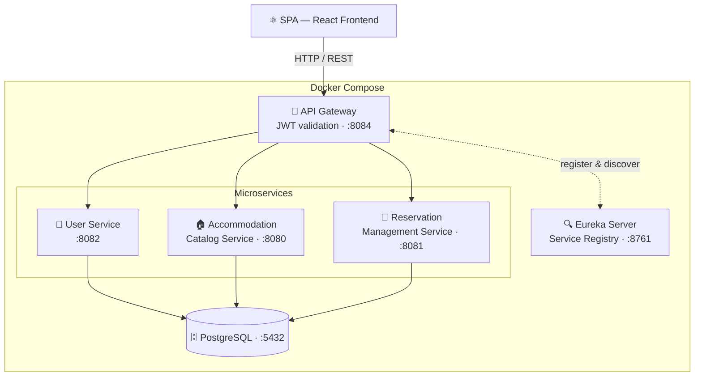
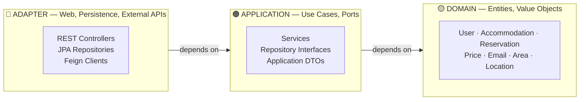

# OneFlat


A rental platform built with **5 independent Spring Boot microservices**.
Demonstrates **Clean Architecture** (Onion pattern), centralized JWT authentication, and dynamic service discovery — fully containerized with Docker Compose.

---

## Architecture Overview



The **API Gateway** is the single entry point for all client requests. It validates JWT tokens before
routing, and resolves service addresses dynamically through the **Eureka** registry. Each service
owns its own business domain independently.

---

## Clean Architecture — Layer Independence



This project applies **Clean Architecture** (Robert C. Martin, *Clean Architecture*, 2017), also
known as **Onion Architecture** (Jeffrey Palermo, 2008). The governing rule is the
**Dependency Rule**: source code dependencies must point inward only.

| Layer | Role | Framework knowledge |
|---|---|---|
| **DOMAIN** | Entities and Value Objects with their invariants | None — plain Java |
| **APPLICATION** | Orchestrates use cases; defines repository interfaces (ports) | None |
| **ADAPTER** | Implements ports: Spring MVC controllers, JPA repos, Feign clients | Here only |

**Concrete consequence:** replacing PostgreSQL with another database, or adding a Kafka consumer
alongside the REST controllers, requires changes only in the ADAPTER layer. The domain and
application logic are untouched.

```java
// Business rules live in the domain, not in framework annotations
public record Price(double value) {
    public Price {
        if (value <= 0) throw new DomainRuleViolated("Price must be positive");
    }
}
```

---

## Architecture Decisions

### ADR-01 — JWT validated at the gateway, not in each service

**Context:** Multiple services need to authenticate incoming requests.  
**Decision:** Validate JWT once in the API Gateway (Spring Cloud Gateway, reactive/WebFlux).
Services are unreachable from the outside without a valid token, except for explicitly whitelisted
public routes.  
**Consequence:** Auth logic is centralized; services are stateless with respect to authentication.
The reactive (WebFlux) constraint is imposed by Spring Cloud Gateway's non-blocking model.

---

### ADR-02 — Clean Architecture (Onion pattern) in every service

**Context:** Business logic at risk of coupling to Spring/JPA framework details.  
**Decision:** Apply Clean Architecture with three concentric layers (adapter / application / domain),
all dependencies pointing inward. Based on Robert C. Martin's *Clean Architecture* (2017).  
**Consequence:** Domain is fully framework-agnostic and independently testable. Infrastructure
(DB engine, HTTP transport) can be swapped without touching business rules.

---

### ADR-03 — Shared `common` Maven module

**Context:** Domain Value Objects and inter-service Feign clients are needed in multiple services.  
**Decision:** A Maven multi-module `common` library with two sub-modules: `common-domain`
(Value Objects shared across services) and `common-adapter` (Feign client interfaces).  
**Consequence:** Single source of truth for domain contracts. Trade-off: compile-time coupling within
the mono-repo — accepted because the domain is stable and this is a cohesive product.

---

### ADR-04 — Netflix Eureka for service discovery

**Context:** Docker containers receive dynamic IPs at runtime; hardcoding addresses is fragile.  
**Decision:** Netflix Eureka (Spring Cloud) lets services self-register by logical name. The gateway
resolves them at routing time without any static configuration.  
**Consequence:** Services are addressed by name (`ACCOMMODATION-CATALOG-SERVICE`), enabling
independent scaling and zero-config inter-service routing via OpenFeign.

---

## Getting Started

**Prerequisites:** Docker and Docker Compose.

```bash
git clone https://github.com/<your-username>/OneFlat.git
cd OneFlat
docker-compose up --build
```

Once all containers are up, try the full auth flow via the gateway:

```bash
# 1. Register a user
curl -X POST http://localhost:8084/api/v1/auth/register \
  -H "Content-Type: application/json" \
  -d '{
    "firstName": "Alice",
    "lastName": "Dupont",
    "email": "alice@example.com",
    "phoneNumber": "+33600000000",
    "password": "secret"
  }'

# 2. Log in → copy the returned token
curl -X POST http://localhost:8084/api/v1/auth/login \
  -H "Content-Type: application/json" \
  -d '{"email": "alice@example.com", "password": "secret"}'
```

| Service | Port | URL |
|---|---|---|
| API Gateway (entry point) | 8084 | `http://localhost:8084` |
| Eureka Dashboard | 8761 | `http://localhost:8761` |
| pgAdmin | 5050 | `http://localhost:5050` |

> Individual service ports (8080, 8081, 8082) are exposed for local development.
> In production, all traffic goes through the gateway on **:8084**.

---

## Tech Stack

| Layer | Technology |
|---|---|
| Language | Java 21 |
| Framework | Spring Boot 3.2 · Spring Cloud 2023 |
| API Gateway | Spring Cloud Gateway (WebFlux / reactive) |
| Service Discovery | Netflix Eureka |
| Security | Spring Security + JWT (jjwt) |
| Inter-service HTTP | OpenFeign |
| Persistence | Spring Data JPA + PostgreSQL |
| Build | Maven (multi-module) |
| Containers | Docker · Docker Compose |

---

## Full API Reference

See **[API_REFERENCE.md](./API_REFERENCE.md)** for the complete endpoint documentation, request
bodies, response shapes, and status codes for all four service groups:

- 🔐 Authentication (`/api/v1/auth`)
- 👤 Users (`/api/v1/users`)
- 🏠 Accommodations (`/api/v1/accommodations`)
- 📅 Reservations (`/api/v1/reservations`)

> All requests go through the gateway on **:8084**.
> Public endpoints (registration, login, browsing accommodations) do not require a token.
> All other endpoints require the header `Authorization: Bearer <token>`.
